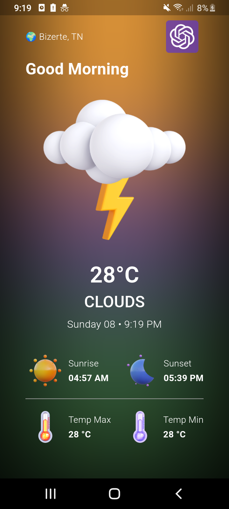
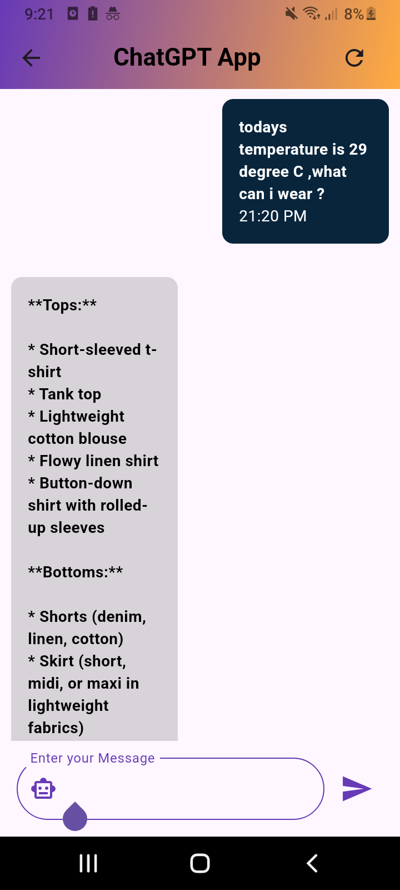

# Modern Weather App ☀️🌧️

Welcome to the **Modern Weather App**, a sleek and futuristic application that not only provides real-time weather data but also integrates an intelligent AI-powered chatbot for enhanced user interaction. This app is built with modern design principles and innovative features to offer a seamless and interactive user experience.

## 🚀 Features

Here’s what makes this app stand out:

### 1. 🌟 Futuristic & Fancy UI
- The app features a clean, modern, and visually appealing UI, using advanced Flutter widgets and layouts.
- Thoughtfully designed transitions and animations enhance the overall user experience, making navigation smooth and intuitive.

### 2. 📍 Real-time Weather Data
- Get accurate, real-time weather information based on your current location, thanks to **GPS integration** (using the `geolocator` package).
- Powered by the **OpenWeatherMap API**, the app provides live updates on temperature, humidity, wind speed, and more.

### 3. 🤖 AI-powered Weather Chatbot
- Integrated with an **Artificial Intelligence Model** using the **Gemini package** to provide a smart, conversational chatbot.
- Users can ask the chatbot weather-related questions or requests, adding a unique and interactive touch to the overall experience.

------------------------------------------------------------------------------------------------------------------------------

## 📱 Screenshots

Here are a few screenshots showcasing the application's design and functionality:

### Weather Page

### GPT ChatBot Page

------------------------------------------------------------------------------------------------------------------------------

## 🛠️ Technologies Used

- **Flutter**: For building the cross-platform mobile application with beautiful and responsive UIs.
- **BLoC Package**: I use BLoC as a state management solution for this project.
- **Geolocator Package**: For accessing the user's GPS location to provide localized weather data.
- **OpenWeatherMap API**: To fetch real-time weather information via OpenWeatherMaps API.
- **Gemini Package**: For AI-driven chatbot capabilities to answer user queries and improve the user experience.
